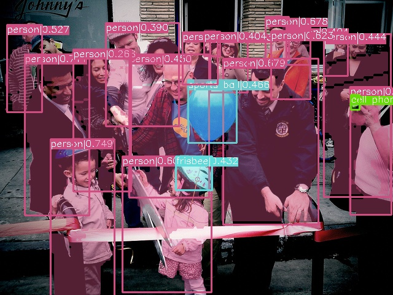
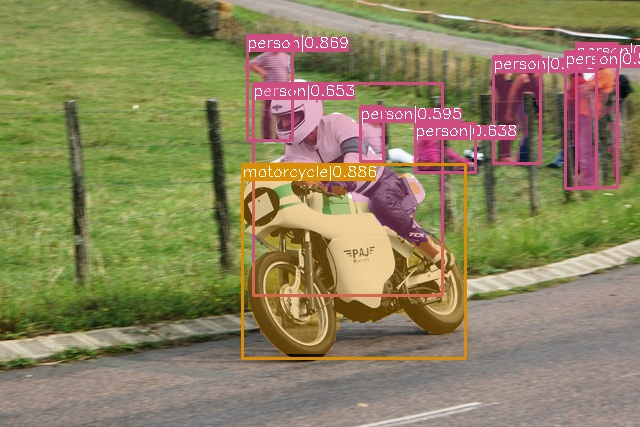

# TensorRT_Inference_Demo
<div align="center">



</div>

<div align="center">

  [](https://developer.nvidia.com/cuda-toolkit-archive)
  [](https://developer.nvidia.com/nvidia-tensorrt-8x-download)
  [](https://releases.ubuntu.com/20.04/)
</div>

## 1.Introduction
This repo use TensorRT-8.x to deploy well-trained models.

## 2.Update

- [x] [YOLOv5](https://github.com/ultralytics/yolov5) (sd)
- [x] [YOLOv5-seg](https://github.com/ultralytics/yolov5)
- [x] [YOLOv7](https://github.com/WongKinYiu/yolov7)
- [x] [YOLOv8](https://github.com/ultralytics/ultralytics)
- [x] [YOLOv8-seg](https://github.com/ultralytics/ultralytics)


## 3.Support Models
All speed tests were performed on RTX 3090 with COCO Val set.The time calculated here is the sum of the time of image preprocess, inference and postprocess, since image loading and visualizing are not counted in, the actual spedd will be a little slower.

| Models | BatchSize | Mode | Input Shape(HxW) | FPS* | FPS  |
|-|-|:-:|:-:|:-:|:-:|
| YOLOv5-n v7.0 | 1 | FP32 | 640x640 | 724 | 
| YOLOv5-s v7.0  | 1 | FP32 | 640x640 | 468 |
| YOLOv5-s v7.0  | 32 | FP32 | 640x640 | - |
| YOLOv5-m v7.0  | 1 | FP32 | 640x640 | 270 |
| YOLOv5-l v7.0  | 1 | FP32 | 640x640 | 151 |
| YOLOv5-x v7.0  | 1 | FP32 | 640x640 | 94  |
| YOLOv7  | 1 | FP32 | 640x640 | 154 |
| YOLOv7x  | 1 | FP32 | 640x640 | - | - |
| YOLOv8-n  | 1 | FP32 | 640x640 | 390 | 127 |
| YOLOv8-s  | 1 | FP32 | 640x640 | 171 | 101 |
| YOLOv8-m  | 1 | FP32 | 640x640 | 122 |
| YOLOv8-l  | 1 | FP32 | 640x640 | 88 |
| YOLOv8-x  | 1 | FP32 | 640x640 | 68 |
| RT-DETR  | 1 | FP32 | 640x640 | - | - |
| RT-DETR  | 1 | FP32 | 640x640 | - | - |
+ FPS* means that the time of image loading, image processing and visualization are taken into account when calculating.FPS only counts image processing time(preprocess, inference, postprocess).

## 4.Usage
1. Clone the repo.
```
git clone https://github.com/Li-Hongda/TensorRT_Inference_Demo.git
cd TensorRT_Inference_Demo/object_detection
```
2. Change the path [here](https://github.com/Li-Hongda/TensorRT_Inference_Demo/blob/main/object_detection/CMakeLists.txt#L19) to your TensorRT path, and [here](https://github.com/Li-Hongda/TensorRT_Inference_Demo/blob/main/object_detection/CMakeLists.txt#L11) to your CUDA path. Then,
```
mkdir build && cd build
cmake ..
make -j$(nproc)
```
3. The executable file will be generated in `bin` in the repo directory if compile successfully.Then enjoy yourself with command like this:
```
cd bin
./object_detection yolov5 /path/to/input/dir 
```


